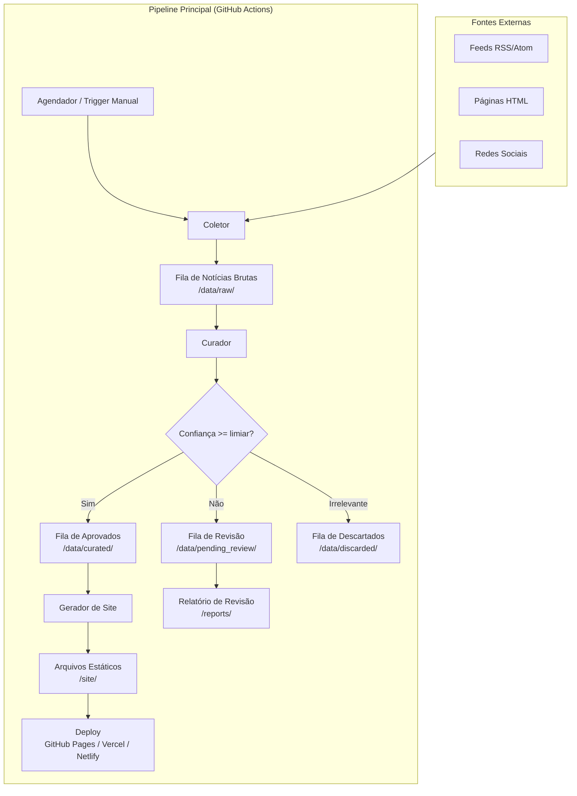
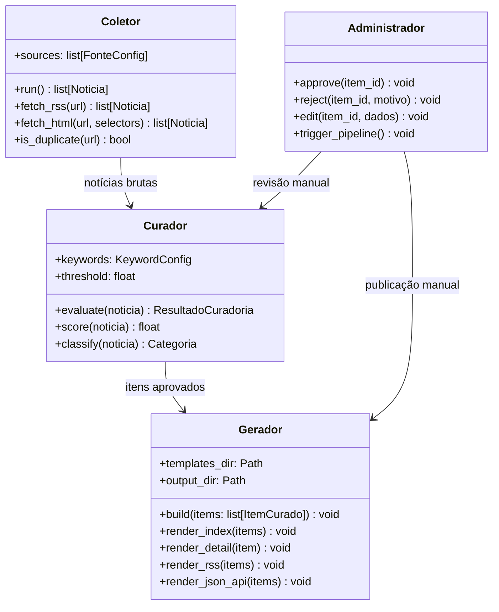

# Design Técnico — Terrobook Portal

## Visão Geral

O Terrobook Portal é um sistema de curadoria automatizada de notícias literárias voltado ao nicho de terror, suspense, thriller, mistério, weird fiction e true crime. A arquitetura é orientada a pipelines: um **Coletor** varre fontes externas, um **Curador** filtra e classifica o conteúdo, e um **Gerador** produz um site estático publicado em plataformas gratuitas (GitHub Pages, Vercel, Netlify).

O sistema opera inteiramente sem servidor em execução contínua. Todo o estado persistente é armazenado em arquivos JSON/YAML versionáveis. A execução é orquestrada por GitHub Actions em ciclos agendados ou acionados manualmente.

### Decisões de Design Principais

| Decisão | Escolha | Justificativa |
|---|---|---|
| Linguagem principal | Python 3.11+ | Ecossistema maduro para scraping, NLP e geração estática |
| Gerador de site estático | Jinja2 + scripts Python | Controle total sem dependência de frameworks pesados |
| Armazenamento | Arquivos JSON/YAML | Sem banco de dados; versionável no Git |
| Orquestração | GitHub Actions | Gratuito, integrado ao repositório |
| Curadoria | Keyword scoring + LLM opcional | Determinístico por padrão; LLM como fallback configurável |
| Feed | RSS/Atom + JSON API | Compatibilidade máxima com leitores externos |

---

## Arquitetura

O sistema é composto por três pipelines sequenciais executados pelo GitHub Actions:



### Componentes Principais



---

## Componentes e Interfaces

### 1. Coletor (`src/collector/`)

Responsável por varrer fontes e extrair notícias brutas.

**Interface principal:**

```python
class Coletor:
    def run(self) -> CollectionResult:
        """Executa varredura em todas as fontes configuradas."""

    def fetch_rss(self, source: FonteConfig) -> list[Noticia]:
        """Coleta notícias de um feed RSS/Atom."""

    def fetch_html(self, source: FonteConfig) -> list[Noticia]:
        """Coleta notícias via scraping HTML com seletores CSS configuráveis."""

    def is_duplicate(self, url: str) -> bool:
        """Verifica se a URL já foi coletada anteriormente."""
```

**Resultado da coleta:**

```python
@dataclass
class CollectionResult:
    collected: list[Noticia]
    skipped_duplicates: int
    errors: list[SourceError]
```

### 2. Curador (`src/curator/`)

Avalia relevância e classifica notícias.

**Interface principal:**

```python
class Curador:
    def evaluate(self, noticia: Noticia) -> ResultadoCuradoria:
        """Avalia uma notícia e retorna classificação + pontuação."""

    def score(self, noticia: Noticia) -> float:
        """Calcula pontuação de relevância (0.0 a 1.0)."""

    def classify(self, noticia: Noticia) -> Categoria | None:
        """Atribui categoria ao conteúdo relevante."""
```

**Resultado da curadoria:**

```python
@dataclass
class ResultadoCuradoria:
    noticia: Noticia
    status: StatusCuradoria  # APROVADO | PENDENTE_REVISAO | DESCARTADO
    score: float
    categoria: Categoria | None
    motivo_rejeicao: str | None
```

### 3. Gerador de Site (`src/generator/`)

Produz os arquivos estáticos a partir dos itens curados.

**Interface principal:**

```python
class Gerador:
    def build(self, items: list[ItemCurado]) -> BuildResult:
        """Gera todos os arquivos estáticos."""

    def render_index(self, items: list[ItemCurado]) -> None:
        """Renderiza página inicial."""

    def render_detail(self, item: ItemCurado) -> None:
        """Renderiza página de detalhe de um item."""

    def render_rss(self, items: list[ItemCurado]) -> None:
        """Gera feed RSS/Atom."""

    def render_json_api(self, items: list[ItemCurado]) -> None:
        """Gera arquivo JSON público."""
```

### 4. Configuração (`config/`)

Toda a configuração é declarativa em arquivos YAML versionáveis:

- `config/sources.yaml` — lista de fontes com tipo (rss/html), URL e seletores
- `config/keywords.yaml` — palavras-chave por gênero e tipo de evento
- `config/settings.yaml` — limiar de confiança, frequência de varredura, plataforma de deploy

### 5. Armazenamento (`data/`)

```
data/
  raw/           # Notícias brutas coletadas (JSON por data)
  curated/       # Itens aprovados (JSON por item)
  pending_review/ # Itens aguardando revisão manual
  discarded/     # Itens rejeitados com motivo
  seen_urls.json # Índice de URLs já coletadas (deduplicação)
```

### 6. GitHub Actions (`.github/workflows/`)

```yaml
# pipeline.yml — executado diariamente e sob demanda
jobs:
  collect:   # Executa Coletor
  curate:    # Executa Curador
  generate:  # Executa Gerador
  deploy:    # Publica site estático
  report:    # Gera relatório de revisão pendente
```

---

## Modelos de Dados

### Noticia (notícia bruta coletada)

```python
@dataclass
class Noticia:
    url: str                    # Identificador único
    titulo: str
    data_publicacao: datetime
    fonte_id: str               # ID da FonteConfig
    texto_resumido: str
    coletado_em: datetime
    raw_html: str | None        # Conteúdo bruto para reprocessamento
```

### ItemCurado (notícia aprovada para publicação)

```python
@dataclass
class ItemCurado:
    id: str                     # UUID gerado na aprovação
    noticia: Noticia
    categoria: Categoria
    generos: list[Genero]
    score: float
    aprovado_em: datetime
    aprovado_por: str           # "auto" | "admin:<nome>"
    # Campos enriquecidos (opcionais, preenchidos pelo Curador ou Admin)
    titulo_original: str | None
    autor: str | None
    editora: str | None
    data_prevista: str | None
    sinopse: str | None
    itens_relacionados: list[str]  # IDs de ItemCurado
```

### FonteConfig (configuração de fonte)

```python
@dataclass
class FonteConfig:
    id: str
    nome: str
    url: str
    tipo: TipoFonte             # RSS | HTML
    seletores: dict | None      # Para tipo HTML
    ativo: bool
    ultima_varredura: datetime | None
```

### Enumerações

```python
class Categoria(str, Enum):
    TRADUCAO_ANUNCIADA = "Tradução Anunciada"
    LANCAMENTO_PREVISTO = "Lançamento Previsto"
    NOVO_AUTOR_NACIONAL = "Novo Autor Nacional"
    AUTOR_INTERNACIONAL_PT = "Autor Internacional em Português"
    NOTICIA_GERAL = "Notícia Geral do Gênero"

class Genero(str, Enum):
    TERROR = "terror"
    SUSPENSE = "suspense"
    THRILLER = "thriller"
    MISTERIO = "misterio"
    WEIRD_FICTION = "weird_fiction"
    TRUE_CRIME = "true_crime"

class StatusCuradoria(str, Enum):
    APROVADO = "aprovado"
    PENDENTE_REVISAO = "pendente_revisao"
    DESCARTADO = "descartado"

class TipoFonte(str, Enum):
    RSS = "rss"
    HTML = "html"
```

### KeywordConfig (configuração de palavras-chave)

```python
@dataclass
class KeywordConfig:
    por_genero: dict[Genero, list[str]]
    por_evento: dict[str, list[str]]  # "lancamento", "traducao", "autor"
    limiar_confianca: float           # 0.0 a 1.0, padrão 0.6
```

### Estrutura de arquivos de dados

```json
// data/curated/2024-01-15_uuid.json
{
  "id": "550e8400-e29b-41d4-a716-446655440000",
  "url": "https://darkside.com.br/...",
  "titulo": "Darkside anuncia tradução de...",
  "categoria": "Tradução Anunciada",
  "generos": ["terror"],
  "score": 0.92,
  "aprovado_em": "2024-01-15T10:30:00Z",
  "aprovado_por": "auto"
}
```

---


## Propriedades de Corretude

*Uma propriedade é uma característica ou comportamento que deve ser verdadeiro em todas as execuções válidas do sistema — essencialmente, uma declaração formal sobre o que o sistema deve fazer. As propriedades servem como ponte entre especificações legíveis por humanos e garantias de corretude verificáveis por máquina.*

**Reflexão sobre redundâncias antes de listar as propriedades:**

- 3.2, 3.3 e 3.4 são variações da mesma regra: "para qualquer ItemCurado, o HTML de detalhe deve conter os campos disponíveis do item". Consolidadas em Property 5.
- 4.4 e 4.5 são variações da mesma regra: "o Gerador deve produzir artefatos de saída válidos". Consolidadas em Property 7.
- 3.5 e 3.6 são variações da mesma regra de filtro. Consolidadas em Property 6.
- 2.2 e 2.3 são as duas faces da mesma regra de classificação. Consolidadas em Property 3.
- 2.4 e 2.5 são invariantes complementares sobre o resultado da curadoria. Mantidas separadas por clareza.

---

### Property 1: Coleta preserva campos obrigatórios

*Para qualquer* fonte válida (RSS ou HTML) com conteúdo disponível, toda `Noticia` retornada pelo Coletor deve conter `url`, `titulo`, `data_publicacao` e `texto_resumido` não-nulos e não-vazios.

**Validates: Requirements 1.2**

---

### Property 2: Resiliência a fontes indisponíveis

*Para qualquer* lista de fontes onde um subconjunto está indisponível, o `CollectionResult` deve conter um `SourceError` para cada fonte indisponível e deve conter as notícias coletadas das fontes disponíveis — ou seja, a falha de uma fonte nunca impede a coleta das demais.

**Validates: Requirements 1.4**

---

### Property 3: Deduplicação por URL

*Para qualquer* URL já presente no índice `seen_urls`, tentar coletar uma fonte que retorne essa URL deve resultar em `skipped_duplicates` incrementado e a notícia correspondente ausente de `collected`.

**Validates: Requirements 1.6**

---

### Property 4: Classificação de relevância é consistente com as keywords

*Para qualquer* `Noticia` cujo texto contenha ao menos uma keyword de relevância da configuração ativa, o Curador deve retornar status `APROVADO` ou `PENDENTE_REVISAO` (nunca `DESCARTADO`). Inversamente, para qualquer `Noticia` cujo texto não contenha nenhuma keyword de relevância e não mencione edição em português, o status deve ser `DESCARTADO`.

**Validates: Requirements 2.2, 2.3**

---

### Property 5: Itens aprovados sempre têm categoria

*Para qualquer* `ResultadoCuradoria` com `status == APROVADO`, o campo `categoria` deve ser não-nulo e pertencer ao enum `Categoria`.

**Validates: Requirements 2.4**

---

### Property 6: Baixa confiança implica revisão manual

*Para qualquer* `Noticia` cujo `score` calculado seja maior que zero e menor que o `limiar_confianca` configurado, o `ResultadoCuradoria` deve ter `status == PENDENTE_REVISAO`.

**Validates: Requirements 2.5**

---

### Property 7: Itens descartados sempre têm motivo de rejeição

*Para qualquer* `ResultadoCuradoria` com `status == DESCARTADO`, o campo `motivo_rejeicao` deve ser não-nulo e não-vazio.

**Validates: Requirements 2.7**

---

### Property 8: Score é monotônico em relação às keywords

*Para qualquer* `Noticia` e dois `KeywordConfig` distintos onde a configuração A contém um superconjunto das keywords presentes no texto em relação à configuração B, então `score(noticia, configA) >= score(noticia, configB)`.

**Validates: Requirements 2.6**

---

### Property 9: Filtro por categoria é exato

*Para qualquer* lista de `ItemCurado` e qualquer `Categoria` selecionada, a função de filtro deve retornar exatamente os itens cuja `categoria` é igual à categoria selecionada — sem falsos positivos nem falsos negativos.

**Validates: Requirements 3.5, 3.6**

---

### Property 10: Página de detalhe contém todos os campos disponíveis do item

*Para qualquer* `ItemCurado`, o HTML da página de detalhe gerada deve conter todos os campos não-nulos do item (titulo, autor, editora, sinopse, data_prevista conforme disponíveis) e deve conter a URL de origem como link clicável.

**Validates: Requirements 3.2, 3.3, 3.4, 5.4**

---

### Property 11: Gerador produz artefatos de saída válidos

*Para qualquer* lista não-vazia de `ItemCurado`, o Gerador deve produzir: (a) um arquivo RSS parseável como XML válido contendo todos os itens, e (b) um arquivo JSON parseável contendo todos os itens com seus campos obrigatórios.

**Validates: Requirements 4.4, 4.5**

---

### Property 12: Resiliência a itens problemáticos na geração

*Para qualquer* lista de `ItemCurado` onde um subconjunto causa erro na renderização, o `BuildResult` deve conter os arquivos gerados para os itens válidos e deve registrar um erro para cada item problemático — sem interromper a geração dos demais.

**Validates: Requirements 4.6**

---

### Property 13: Ordenação cronológica decrescente na página inicial

*Para qualquer* lista de `ItemCurado`, o HTML da página inicial gerada deve listar os itens em ordem decrescente de `aprovado_em` — ou seja, para quaisquer dois itens adjacentes na listagem, o item anterior deve ter `aprovado_em` maior ou igual ao do item seguinte.

**Validates: Requirements 5.2**

---

### Property 14: Itens relacionados aparecem na página de detalhe

*Para qualquer* `ItemCurado` com `itens_relacionados` não-vazio, o HTML da página de detalhe deve conter referências (links ou cards) para cada ID presente em `itens_relacionados`.

**Validates: Requirements 5.6**

---

### Property 15: Relatório de revisão contém todos os itens pendentes

*Para qualquer* lista de `ResultadoCuradoria` com ao menos um item `PENDENTE_REVISAO`, o relatório gerado ao final do ciclo deve listar todos e somente os itens com esse status.

**Validates: Requirements 6.3**

---

### Property 16: Relatório de erro contém informações completas

*Para qualquer* `PipelineError` ocorrido durante o ciclo, o relatório de erro deve conter `etapa`, `fonte_id` e `mensagem` não-nulos.

**Validates: Requirements 6.6**

---

## Tratamento de Erros

### Estratégia Geral

O sistema adota uma política de **falha isolada**: erros em componentes individuais (uma fonte, um item) não devem interromper o processamento dos demais. Todos os erros são registrados e reportados ao Administrador ao final do ciclo.

### Erros por Componente

| Componente | Tipo de Erro | Comportamento |
|---|---|---|
| Coletor | Fonte indisponível (timeout, 4xx, 5xx) | Registra `SourceError`, pula fonte, continua |
| Coletor | Feed RSS malformado | Registra erro de parsing, pula fonte |
| Coletor | Seletor HTML inválido | Registra erro de configuração, pula fonte |
| Curador | Erro ao calcular score | Marca item como `PENDENTE_REVISAO` com motivo |
| Gerador | Item com dados inválidos | Registra erro, pula item, continua geração |
| Gerador | Erro de template | Interrompe geração, reporta erro crítico |
| Deploy | Falha no push | Retenta até 3 vezes, reporta falha se persistir |

### Estrutura de Erros

```python
@dataclass
class SourceError:
    fonte_id: str
    url: str
    etapa: str          # "fetch" | "parse" | "config"
    mensagem: str
    timestamp: datetime

@dataclass
class BuildError:
    item_id: str
    etapa: str          # "render_detail" | "render_index" | "render_rss"
    mensagem: str
    timestamp: datetime

@dataclass
class PipelineError:
    etapa: str          # "collect" | "curate" | "generate" | "deploy"
    fonte_id: str | None
    mensagem: str
    timestamp: datetime
    traceback: str | None
```

### Relatórios

Ao final de cada ciclo, o pipeline gera dois arquivos em `/reports/`:

- `report_YYYY-MM-DD.json` — sumário do ciclo: itens coletados, aprovados, pendentes, descartados, erros
- `pending_review_YYYY-MM-DD.json` — lista de itens aguardando revisão manual

---

## Estratégia de Testes

### Abordagem Dual

O projeto utiliza testes de exemplo para comportamentos específicos e testes baseados em propriedades para invariantes universais.

**Biblioteca de PBT:** `hypothesis` (Python) — madura, amplamente adotada, suporta geração de dataclasses e estratégias customizadas.

### Estrutura de Testes

```
tests/
  unit/
    test_collector.py       # Testes de exemplo: RSS, HTML, deduplicação
    test_curator.py         # Testes de exemplo: casos específicos de classificação
    test_generator.py       # Testes de exemplo: renderização de templates
  property/
    test_collector_props.py # Properties 1, 2, 3
    test_curator_props.py   # Properties 4, 5, 6, 7, 8
    test_generator_props.py # Properties 9, 10, 11, 12, 13, 14, 15, 16
  integration/
    test_pipeline.py        # Testes end-to-end do pipeline completo
  smoke/
    test_config.py          # Verificações de configuração e infraestrutura
```

### Configuração dos Testes de Propriedade

Cada teste de propriedade deve:
- Executar mínimo de **100 iterações** (configurado via `@settings(max_examples=100)`)
- Ser anotado com comentário referenciando a propriedade do design
- Usar estratégias `hypothesis` para gerar dados válidos

```python
# Exemplo de estrutura de teste de propriedade
from hypothesis import given, settings
from hypothesis import strategies as st

# Feature: terrobook-portal, Property 3: Deduplicação por URL
@settings(max_examples=100)
@given(url=st.text(min_size=10))
def test_deduplication_by_url(url):
    """Para qualquer URL já vista, coletar novamente deve ignorá-la."""
    seen = SeenUrls()
    seen.add(url)
    result = coletor.collect_with_seen(mock_source_returning(url), seen)
    assert url not in [n.url for n in result.collected]
    assert result.skipped_duplicates >= 1
```

### Testes de Smoke

Verificações de configuração e infraestrutura (execução única):

- Configuração padrão contém fontes de todas as categorias exigidas
- Workflow do GitHub Actions contém cron diário e `workflow_dispatch`
- Site gerado não contém referências a servidor backend
- Dependências não incluem banco de dados em execução contínua
- Arquivos de configuração de deploy estão presentes e válidos

### Testes de Integração

- Pipeline completo com fontes mock: coleta → curadoria → geração
- Verificação de disponibilidade pós-deploy (monitoramento externo)

### Cobertura Esperada

| Componente | Tipo de Teste | Meta de Cobertura |
|---|---|---|
| Coletor | Propriedade + Exemplo | 90% |
| Curador | Propriedade + Exemplo | 90% |
| Gerador | Propriedade + Exemplo | 85% |
| Pipeline | Integração | Fluxo principal + 3 cenários de erro |
| Configuração | Smoke | 100% dos requisitos de infraestrutura |
